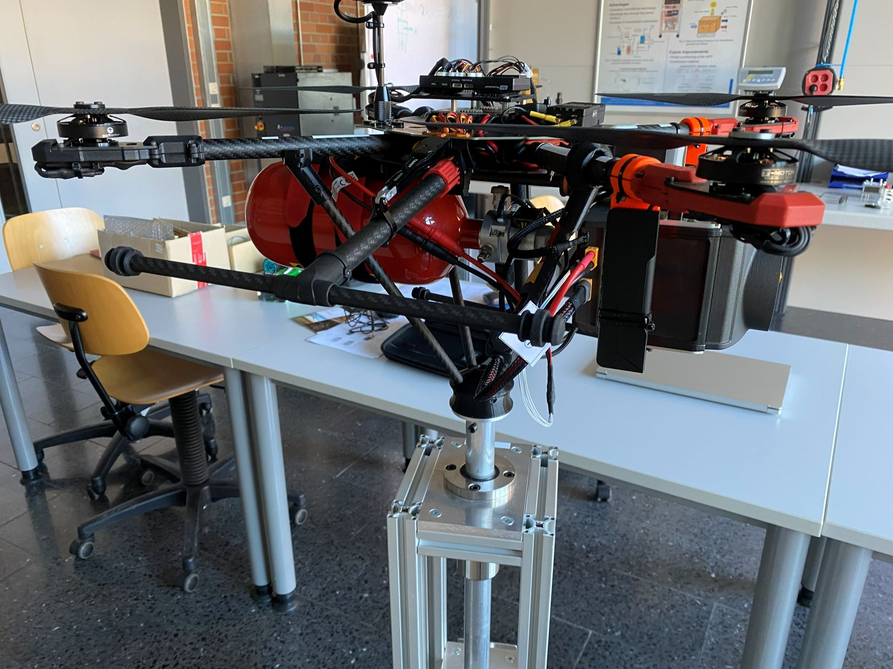

# 🚁 Hydrogen-Powered Multicopter


> Design, integration and performance evaluation of a hydrogen-powered multicopter using a fuel cell and Pixhawk flight controller.

---

## 📸 Preview

<!-- Replace with your images -->
<p align="center">
  
</p>

---

## 📌 Overview

This project investigates the feasibility of **hydrogen fuel cells** as an alternative energy source for UAVs.

A fully functional quadcopter was designed, built, and tested to compare:

- ⚡ Energy efficiency  
- ⏱️ Flight endurance  
- ⚖️ System weight  
- 🔋 Fuel cell vs LiPo performance  

---

## 🎯 Key Features

- 🔋 Hybrid-capable energy system (Fuel Cell + LiPo)
- 🚁 Custom-built quadcopter platform
- 🧠 Pixhawk 4 flight controller (ArduPilot)
- 📡 Telemetry via Herelink
- 📊 Experimental validation with real flight data
- 🔄 Direct comparison: Hydrogen vs Battery

---

## 🏗️ System Architecture

### Hardware

| Component            | Model                     |
|---------------------|---------------------------|
| Frame               | Tarot 650 Sport           |
| Motors              | Antigravity 4006 KV380    |
| Propellers          | T-MOTOR 15x5 CF           |
| ESCs                | T-Motor AIR40A            |
| Flight Controller   | Pixhawk 4                 |
| Power Module        | Holybro PM07              |
| Communication       | Herelink V1.0             |
| Fuel Cell           | IE-SOAR 800W              |
| Battery             | 6S LiPo (8000mAh)         |

---

### Software

- ArduPilot Firmware  
- Mission Planner / QGroundControl  
- Log analysis tools  

---

## 🔧 Implementation

The system was developed end-to-end:

- Mechanical assembly of the drone frame  
- Integration of motors, ESCs, and power distribution  
- Pixhawk setup and parameter tuning  
- Fuel cell integration (electrical + structural)  
- Telemetry and control configuration  

### ⚠️ Key Challenges

- Safe integration of hydrogen system  
- Handling peak loads (fuel cell limitations)  
- Weight vs endurance trade-offs  
- Stable flight under varying power supply  

---

## 🧪 Experimental Setup

A structured testing methodology was implemented:

- Controlled thrust test setup  
- Real flight experiments  
- Data logging (power, thrust, duration)  
- Reproducible test conditions  

---

## 📊 Results

### Key Insights

- ⚡ Fuel cells significantly increase flight endurance  
- 🪶 Higher energy density improves mission duration  
- 🔥 Batteries outperform in peak power scenarios  
- ⚖️ System efficiency depends heavily on mission profile  

### 🧠 Conclusion

> Hydrogen fuel cells are highly promising for **long-endurance UAV missions**, but require hybrid systems to handle dynamic loads.

---

## 📚 Documentation

- 📄 [Project Report](docs/project-report.md)
- 📘 [Full Thesis](docs/thesis.pdf)

---

## 🚀 Applications

- Environmental monitoring  
- Long-range inspection  
- Search & rescue  
- Future sustainable UAV systems  

---

## 🔮 Future Work

- Hybrid energy management system  
- Autonomous mission optimization  
- Simulation (e.g. Unreal Engine / AirSim)  
- Improved fuel cell control integration  

---

## 📁 Repository Structure

```bash
.
├── docs/        # Thesis / documentation
├── images/      # Project images
├── data/        # Flight logs / measurements
└── src/         # Scripts / configs (optional)